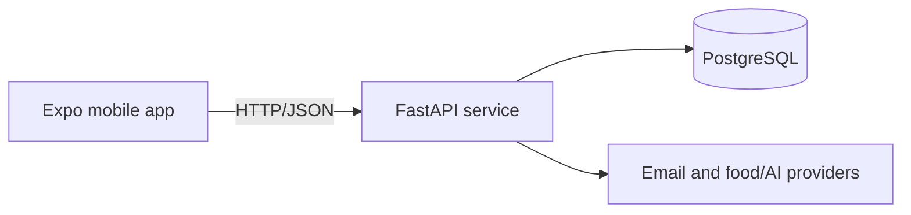

# Nutri Tracker

Nutri Tracker is a personal nutrition tracking application. It combines an Expo mobile client with a FastAPI API and a PostgreSQL database. The current product flow covers account verification, onboarding, food lookup, label capture and daily intake summaries.

## Architecture



The repository is organised as a small monorepo:

- `apps/mobile`: Expo React Native client for authentication, onboarding, scanning and history.
- `services/api`: FastAPI, SQLModel and Alembic service with pytest and Ruff checks.
- `infra`: local PostgreSQL Docker Compose configuration.

## Main features

1. Welcome, registration, login and email verification with resend support.
2. Three-step onboarding for profile data, measurements and daily goals.
3. Barcode lookup and label-photo based product creation.
4. Intake tracking with dashboard, calendar and daily summaries.
5. Profile, settings and social features already exposed by the API.

## Technology

- Backend: Python 3.11, FastAPI, SQLModel/SQLAlchemy, Alembic, psycopg, pytest and Ruff.
- Mobile: Expo SDK 54, React Native, TypeScript and Expo camera/file-system modules.
- Local infrastructure: PostgreSQL 16 via Docker Compose.

## Local setup

Copy the root example file and adjust the values for the machine running the API:

```bash
cp .env.example .env
```

Development can use the PostgreSQL credentials in `infra/docker-compose.yml`. They are local-development defaults and must not be reused in production. Generate distinct `AUTH_SECRET_KEY` and `AI_KEY_ENCRYPTION_SECRET` values for any shared environment. The API accepts a comma-separated `CORS_ORIGINS` list; production must use explicit origins.

With Docker and the project dependencies installed:

```bash
make reset-db
make setup
make api-dev
```

In another terminal, install and start the mobile app:

```bash
cd apps/mobile
npm ci
npm start
```

For a physical device, set `EXPO_PUBLIC_API_BASE_URL` to the computer's LAN address, for example `http://192.168.1.20:8000`. `localhost` points to the device itself.

The development email mode can print verification codes in API logs when SMTP is not configured. Keep `DEV_EMAIL_MODE` and `EXPOSE_VERIFICATION_CODE` disabled outside local development.

## Database and migrations

The API uses Alembic migrations. Start PostgreSQL with `infra/docker-compose.yml`, then run the repository's setup target or `alembic upgrade head` from `services/api`. The full migration path requires PostgreSQL; the CI workflow currently validates the API tests without a service container.

## Validation

Backend checks:

```bash
cd services/api
python -m ruff check .
python -m pytest -q
```

Mobile checks:

```bash
cd apps/mobile
npm ci
npx tsc --noEmit
```

GitHub Actions runs these backend and mobile checks on pushes to `master` or `chore/**`, and on pull requests targeting `master`. A device or emulator is still required for interactive mobile testing. External email, food and AI providers are optional integrations and are not exercised by the fast unit-test suite.

## Current limitations

The repository does not provide a hosted environment or production secret-management system. Docker/PostgreSQL integration checks need a local Docker installation. Mobile dependency advisories remain in the Expo SDK 54 dependency tree; upgrading them safely requires a coordinated Expo upgrade rather than a forced audit rewrite.

## Engineering notes

The project was developed iteratively with automated assistance. The code, tests and operational decisions are kept explicit so they can be reviewed and explained independently.
